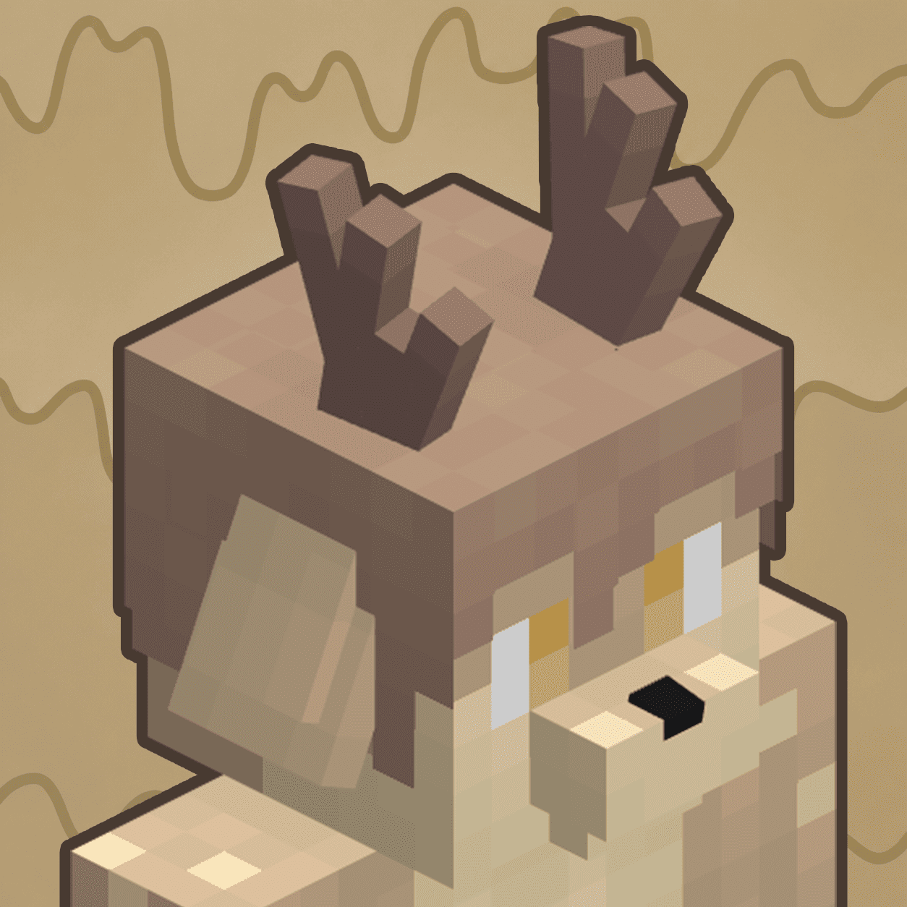

<p align="center">
  
</p>

<h1 align="center">Changed: Synergy</h1>

<p align="center">
  A relationship-focused Forge addon for <em>Changed</em> on Minecraft 1.20.1.
</p>

<p align="center">
  <a href="https://github.com/ParkaBird/changed-synergy/releases"></a>
  <a href="https://github.com/ParkaBird/changed-synergy/blob/main/LICENSE.txt"></a>
  
  
</p>

Changed: Synergy turns aggressive latex creatures into neighbors you can actually get along with. An orange or a friendly pat will often get you further than fists and blades. Transfur is not always the end. Sometimes, you can even talk your way back out of it.

Creatures have persistent names, individual personalities, memories and social behavior. You can befriend them, build affection, form one voluntary bond and watch them interact with their surroundings.

> [!WARNING]
> Synergy is in beta and changes AI, entity state and world data. Back up important worlds before installing or updating it.

## At a glance

- Friendship, affection, faction reputation and an exclusive bond system
- Social, relationship and creature-function radial menus
- Negotiation after involuntary assimilation, absorption or fusion
- Context-aware dialogue in English and Simplified Chinese
- Grapple and hypnosis QTEs, improved movement, swimming and combat behavior
- Creature gathering, fishing, hunting, mining, outposts and environmental interactions
- Optional Changed Addon Plus integration, basic Changed Additions support,
  and Golden Orange social/negotiation compatibility for both mods
- Forge configuration screens and gamerules for the main systems

The full feature list, screenshots and release downloads are available on the project pages:

- [Modrinth](https://modrinth.com/mod/changed-synergy)
- [CurseForge](https://www.curseforge.com/minecraft/mc-mods/changed-synergy)
- [GitHub releases](https://github.com/ParkaBird/changed-synergy/releases)

## Requirements

| Component | Supported version | Required |
| --- | --- | --- |
| Minecraft | 1.20.1 | Yes |
| Forge | 47.4.x | Yes |
| Changed | 0.15.7 | Yes |
| Changed Addon Plus | 2.9.2c | No |

Synergy uses targeted mixins and direct integration points. Compatibility with newer Changed or Changed Addon Plus releases is not guaranteed. See [COMPATIBILITY.md](COMPATIBILITY.md) for the complete support policy.

## Installation

1. Install Forge 47.4.x for Minecraft 1.20.1.
2. Put Changed 0.15.7 and the Synergy JAR in the instance's `mods` folder.
3. Add Changed Addon Plus 2.9.2c only if you want its optional integration.
4. Start the game and check the Forge Mods screen for dependency errors.

Do not install multiple Synergy JARs at the same time.

## Configuration

Open Synergy's configuration screen from the Forge Mods list or through a compatible configuration-menu mod. Client settings control local presentation. Multiplayer gameplay and AI use the server's common configuration and gamerules.

The optional 0.13-style transfur progress mask and skin coating are disabled by default. Players who prefer those effects can enable either one independently without replacing Changed's current presentation for everyone else.

Game-rule names and behavior are documented in [docs/GAMERULES.md](docs/GAMERULES.md).

## Building

Synergy requires Java 17. Clone the repository and run:

```shell
./gradlew build
```

On Windows, use `gradlew.bat build`. Release and source JARs are written to `build/libs`.

`-PwithoutAddon` removes Changed Addon Plus from the development runtime. Its API remains available at compile time so the optional compatibility layer can compile.

## Repository guide

- [COMPATIBILITY.md](COMPATIBILITY.md) defines the supported game and mod versions.
- [docs/ARCHITECTURE.md](docs/ARCHITECTURE.md) explains the main systems and dependency boundaries.
- [docs/GAMERULES.md](docs/GAMERULES.md) documents the server-side feature switches.
- [KNOWN_ISSUES.md](KNOWN_ISSUES.md) lists current beta limitations.
- [CHANGELOG.md](CHANGELOG.md) records user-facing changes.
- [THIRD_PARTY_NOTICES.md](THIRD_PARTY_NOTICES.md) identifies upstream projects and reused material.

## Reporting bugs

Before opening an issue, check [KNOWN_ISSUES.md](KNOWN_ISSUES.md) and test without unrelated mods when possible. Bug reports should include:

- the crash report or `latest.log`
- exact Forge, Changed and Synergy versions
- whether Changed Addon Plus or Changed Additions is installed
- steps that reproduce the problem

Use the [issue tracker](https://github.com/ParkaBird/changed-synergy/issues) for reproducible bugs. The [Changed: Synergy Discord](https://discord.gg/h2dC8WNpZm) is available for discussion, feedback and development updates.

## Contributing

Read [CONTRIBUTING.md](CONTRIBUTING.md) before submitting a patch. The project does not yet have an automated in-game regression suite, so gameplay changes must include clear manual test steps.

## Credits, AI assistance and license

Changed: Synergy is developed by ParkaBird. It is an unofficial addon and is not affiliated with the creators of Changed or Mojang Studios.

Generative AI assisted parts of the bilingual text and code. ParkaBird reviewed, edited, integrated and tested the resulting work. Artwork, textures, models, screenshots and promotional images are not AI-generated. Details are in [AI_DISCLOSURE.md](AI_DISCLOSURE.md) and [THIRD_PARTY_NOTICES.md](THIRD_PARTY_NOTICES.md).

Changed: Synergy is licensed under [GPL-3.0-or-later](LICENSE.txt).
